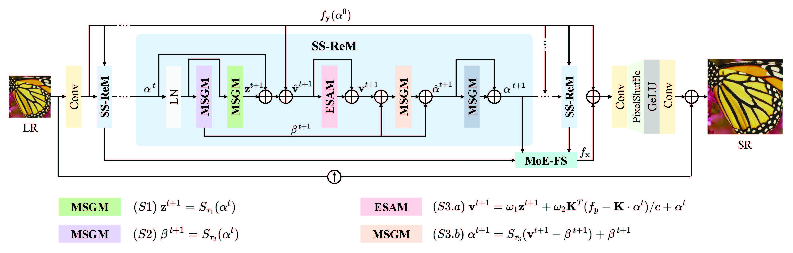

# Structural Similarity-Inspired Unfolding for Lightweight Image Super-Resolution
#### IEEE Transactions on Image Processing, 2025

[Zhangkai Ni](https://eezkni.github.io/)<sup>1</sup>, Yang Zhang<sup>1</sup>, [Wenhan Yang](https://flyywh.github.io/)<sup>2</sup>, [Hanli Wang](https://scholar.google.com/citations?user=WioFu64AAAAJ&hl=zh-CN)<sup>1</sup>, [Shiqi Wang](https://scholar.google.com/citations?user=Pr7s2VUAAAAJ&hl=en)<sup>3</sup>, [Sam Kwong](https://scholar.google.com/citations?user=_PVI6EAAAAAJ&hl=zh-CN)<sup>4</sup>

<sup>1</sup>Tongji University, <sup>2</sup>Peng Cheng Laboratory, <sup>3</sup>City University of Hong Kong, <sup>4</sup>Lingnan Univerity

This repository provides the official implementation for the paper "Structural Similarity-Inspired Unfolding for Lightweight Image Super-Resolution," IEEE Transactions on Image Processing, 2025. [Paper]()



## About SSIU

Major efforts in data-driven image super-resolution (SR) primarily focus on expanding the receptive field of the model to better capture contextual information.
However, these methods are typically implemented by stacking deeper networks or leveraging transformer-based attention mechanisms, which consequently increases model complexity.
In contrast, model-driven methods based on the unfolding paradigm show promise in improving performance while effectively maintaining model compactness through sophisticated module design.
Based on these insights, we propose a Structural Similarity-Inspired Unfolding (SSIU) method for efficient image SR. This method is designed through unfolding a SR  optimization function constrained by structural similarity, aiming to combine the strengths of both data-driven and model-driven approaches.
Our model operates progressively following the unfolding paradigm. Each iteration consists of multiple Mixed-Scale Gating Modules (MSGM) and an Efficient Sparse Attention Module (ESAM). The former implements comprehensive constraints on features, including a structural similarity constraint, while the latter aims to achieve sparse activation.
In addition, we design a Mixture-of-Experts-based Feature Selector (MoE-FS) that fully utilizes multi-level feature information by combining features from different steps.
Extensive experiments validate the efficacy and efficiency of our unfolding-inspired network.
Our model outperforms current state-of-the-art models, boasting lower parameter counts and reduced memory consumption. 

**TL;DR:** We propose a novel Structural Similarity-Inspired Unfolding (SSIU) network for lightweight image SR, which sparsely activates long-range pixels, leading to improved SR results with a lightweight architecture.

## Environment setup
To start, we prefer creating the environment using conda:
```sh
conda create -n ssiu
conda activate ssiu
pip install -r requirements.txt
```

[Pytorch](https://pytorch.org/) installation is machine dependent, please install the correct version for your machine.

<details>
  <summary> Dependencies (click to expand) </summary>

  - `PyTorch`, `numpy`: main computation.
  - `pytorch-msssim`: SSIM calculation.
  - `tqdm`: progress bar.
  - `opencv-python`,`scikit-image`: image processing.
  - `imageio`: images I/O.
  - `einops`: torch tensor shaping with pretty api.
  - `PyYAML`: parsing and generating YAML files.
</details>

## Getting the data
The [DF2K](https://www.kaggle.com/datasets/anvu1204/df2kdata?select=DF2K_train_HR) and [benchmark](https://github.com/odefiao/SR-Test-Dataset) are used in our paper and mainly includes the following datasets:

- Flickr2K
- DIV2K
- [B100](https://github.com/odefiao/SR-Test-Dataset/tree/master/B100)
- [Manga109](https://github.com/odefiao/SR-Test-Dataset/tree/master/Manga109)
- [Set5](https://github.com/odefiao/SR-Test-Dataset/tree/master/Set5)
- [Set14](https://github.com/odefiao/SR-Test-Dataset/tree/master/Set14)
- [Urban100](https://github.com/odefiao/SR-Test-Dataset/tree/master/Urban100)

## Directory structure for the datasets

<details>
  <summary> (click to expand;) </summary>

    data_path
    ├── DF2K     # Link: https://www.kaggle.com/datasets/anvu1204/df2kdata?select=DF2K_train_HR
    │   ├── DF2K_train_HR
    │   └── DF2K_train_LR_bicubic
    │        ├── X2
    │        ├── X3
    │        └── X4
    └── benchmark     # Link: https://github.com/odefiao/SR-Test-Dataset
        ├── B100
        │   ├── HR
        │   └── LR_bicubic
        │       ├── X2
        │       ├── X3
        │       └── X4
        ├── Manga109
        │   ├── HR
        │   └── LR_bicubic
        │       ├── X2
        │       ├── X3
        │       └── X4
        ├── Set5
        │   ├── HR
        │   └── LR_bicubic
        │       ├── X2
        │       ├── X3
        │       └── X4
        ├── Set14
        │   ├── HR
        │   └── LR_bicubic
        │       ├── X2
        │       ├── X3
        │       └── X4
        └── Urban100
            ├── HR
            └── LR_bicubic
                ├── X2
                ├── X3
                └── X4

</details>


## Running the model
### Training
- Prepare the training dataset.
- Modify `data_path` in the `./configs/*.yml`, which contains the [DF2K](https://www.kaggle.com/datasets/anvu1204/df2kdata?select=DF2K_train_HR) and [benchmark](https://github.com/odefiao/SR-Test-Dataset).
- Run the following commands for training:
```bash
# x2 commands
$ python train.py --config ./configs/SSUFSR_light_x2.yml
# x3 commands
$ python train.py --config ./configs/SSUFSR_light_x3.yml
# x4 commands
$ python train.py --config ./configs/SSUFSR_light_x4.yml
```

### Testing
- Prepare the testing dataset.
- Modify `data_path` in the `./configs/*.yml`, which contains the [DF2K](https://www.kaggle.com/datasets/anvu1204/df2kdata?select=DF2K_train_HR) and [benchmark](https://github.com/odefiao/SR-Test-Dataset).
- Prepare the pretrained model.
- Modify `pretrain` in the `./configs/*.yml`, which corresponds to the path of the pretrained model.
- Run the following commands for tesing:
```bash
# x2 commands
$ python test.py --config ./configs/SSUFSR_light_x2.yml
# x3 commands
$ python test.py --config ./configs/SSUFSR_light_x3.yml
# x4 commands
$ python test.py --config ./configs/SSUFSR_light_x4.yml
```


## Results
Pretrained models can be find in the `./pretrain_model` folder.

## Citation
If you find our work useful, please cite it as
```
@article{ni2025ssiu,
  title={Structural Similarity-Inspired Unfolding for Lightweight Image Super-Resolution},
	author={Ni, Zhangkai, and Zhang, Yang, and Yang, Wenhan, and Wang, Hanli, and Wang, Shiqi and Kwong, Sam},
	journal={IEEE Transactions on Image Processing},
	volume={},
	pages={},
	year={2025},
	publisher={IEEE}
}
```

## Acknowledgments
This code is inspired by [ELAN](https://github.com/xindongzhang/ELAN). We thank the authors for the nicely organized code!


## Contact
Thanks for your attention! If you have any suggestion or question, feel free to leave a message here or contact Dr. Zhangkai Ni (eezkni@gmail.com).


<!-- ## License
[MIT License](https://opensource.org/licenses/MIT) -->
